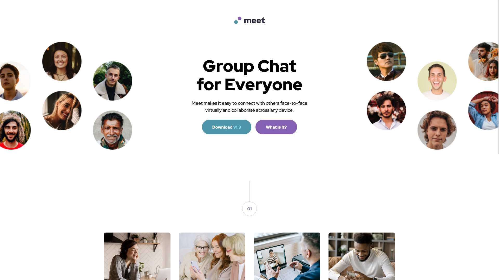
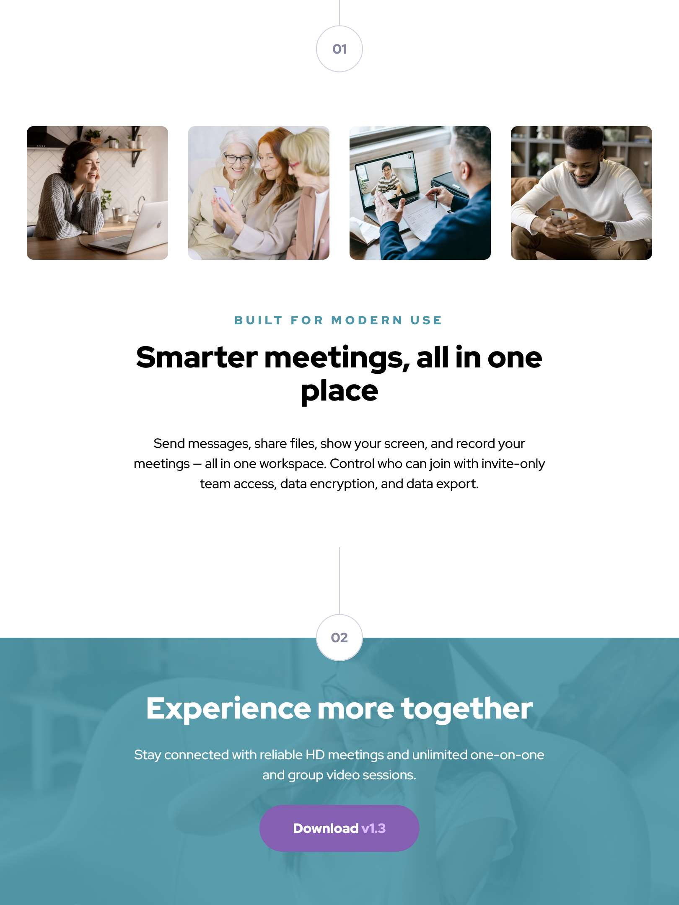

# Frontend Mentor - Meet landing page solution

This is a solution to the [Meet landing page challenge on Frontend Mentor](https://www.frontendmentor.io/challenges/meet-landing-page-rbTDS6OUR). Frontend Mentor challenges help you improve your coding skills by building realistic projects. 

## Table of contents

- [Overview](#overview)
  - [Screenshot](#screenshot)
  - [Links](#links)
- [My process](#my-process)
  - [Built with](#built-with)
  - [What I learned](#what-i-learned)
  - [My favourite code](#my-favourite-code)
  - [Useful resources](#useful-resources)
- [Author](#author)
- [Acknowledgments](#acknowledgments)


## Overview

### Screenshot
<div style="display: flex; gap: 0.5rem;">

</div>
<br />
<div style="display: flex; gap: 0.5rem;">
  
  
</div>
<br />
<div style="display: flex; gap: 0.5rem;">
  
  
</div>


### Links

- Solution URL: [Meet Landing page Solution](https://github.com/kapil-2695/fmc-meet-landing-page)
- Live Site URL: [Live site - Meet Landing page](https://kapil-2695.github.io/fmc-meet-landing-page)


## My process
  
### Built with

- Semantic HTML5 markup
- CSS custom properties, text-presets for `font`
- CSS Grid `grid-template`.
- CSS `clamp()` function
- CSS background image with colour overlay.
- CSS media query


### What I learned

- I learnt how the natural flow of HTML is and how sometimes it is better to follow the flow iinstead of using flexbox or grid.
- I learned to make use of `clamp()` function with CSS grid to dynamically adjust the grid row height based on the width of the screen.
- I learned to set the margins dynamically using `clamp()` function.


### My favourite code

Adjust the height of the grid row proportional to screen width to zoom in the banner image smoothly.
```css
.hero-section {
    display: grid;
    justify-items: center;
    padding: 4rem 2rem 2rem;
    grid-template-rows: clamp(10rem, 10rem + 30vw, 30rem) auto;
    gap: 3rem;
}
```

The use of dynamic spacing which reduced the margin on very small screens sizes to make more room for the content.
```css
:root {
    --dyn-spacing: clamp(0.5rem, 8vw, 2rem);
}
.features-section {
    display: grid;
    gap: 4rem;
    padding: 2rem var(--dyn-spacing) 4rem;
    justify-items: center;
}
```


### Useful resources

- [Learn CSS - web.dev](https://web.dev/learn/css/) - This helped me with CSS code.


## Author

- Frontend Mentor - [@kapil-2695](https://www.frontendmentor.io/profile/kapil-2695)


## Acknowledgments

- I want to thank CSS expert Kevin Powell for creating informative content on his YouTube channel which helped me a lot in perfecting the designs.
